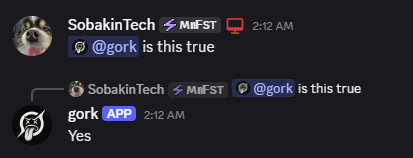

# Gork Discord Bot
## What it does

- Gives random yes/no/maybe responses
- Quotes messages when you reply to them
- Has a 1 second cooldown so you can't spam it

## How to use

### Ask it something

### Reply to someone's message

### Use context menu command on someone's message

## Response chances

- 40% yes responses (Yes, Absolutely, ofc)
- 40% no responses (No, nah fam, ofc not)
- 20% maybe responses (maybe, idk, possibly, who knows)

## Getting the bot

  

    <b>Option 1: Use the hosted version (recommended)</b>
  

  
  [Invite bot](https://discord.com/oauth2/authorize?client_id=1408915123069915230)

  

    <b>Option 2: Self-host</b>
  

  
  1. Clone the repository
  2. Make sure your bot has the `MESSAGE CONTENT` and `SERVER MEMBERS` intent enabled
  3. Rename the `.env.example` file to `.env` and put your bot token in there.
  4. Run `npm install` and then `npm start`

  That's it. Happy groking

